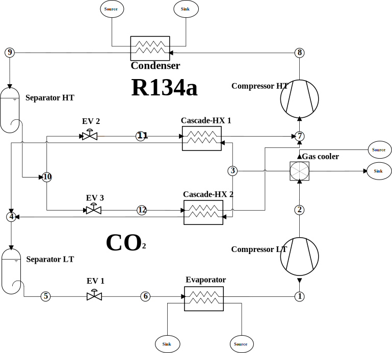

# Refrigeration-Cycle-Simulation

This notebook showcases a newly developed framework for simulating thermo-hydraulic systems, using two refrigeration cycles as illustrative examples.
The notebook can be run interactively on MyBinder.org by clicking on the button 

## One-Stage DX Cycle

## CO2/R134a Cascade Cycle

