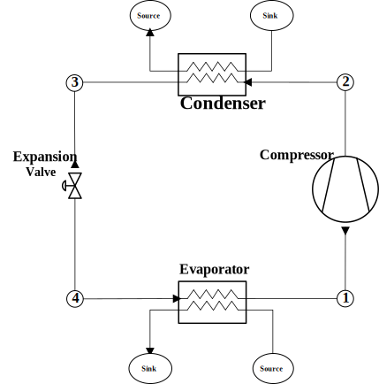

# Refrigeration-Cycle-Simulation

This notebook showcases a newly developed framework for simulating thermo-hydraulic systems, featuring two illustrative examples of refrigeration cycles. The first example demonstrates a **One-Stage DX cycle**, while the second example showcases a **CO2/R134a cascade cycle**.

The notebook can be run interactively on MyBinder.org by clicking on the button

## One-Stage DX Cycle

## CO2/R134a Cascade Cycle 

